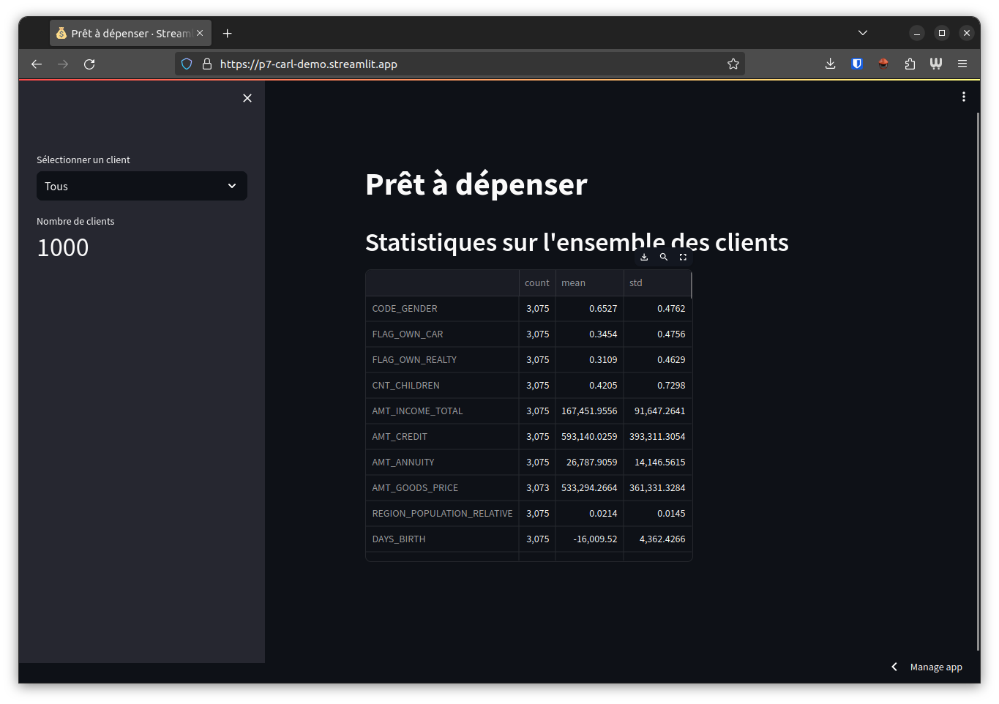
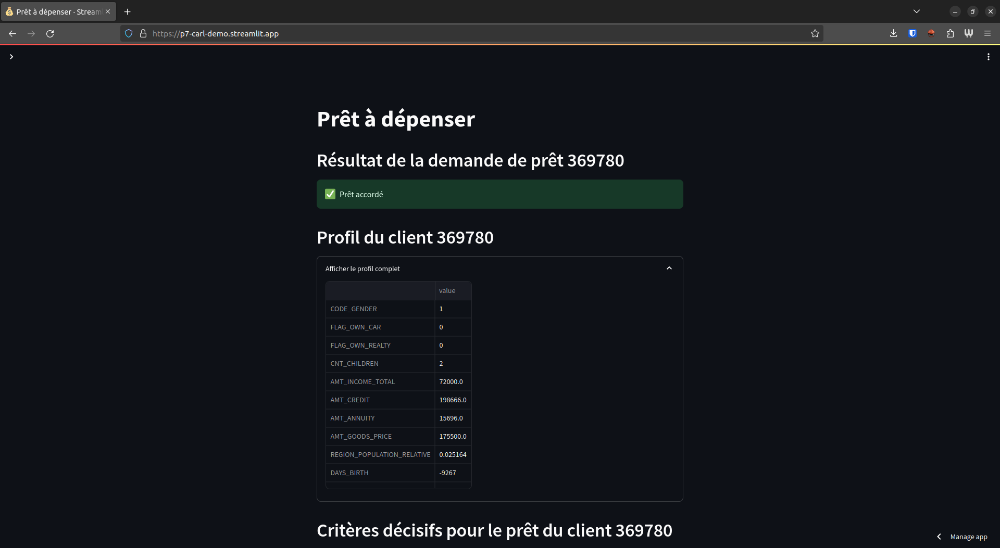
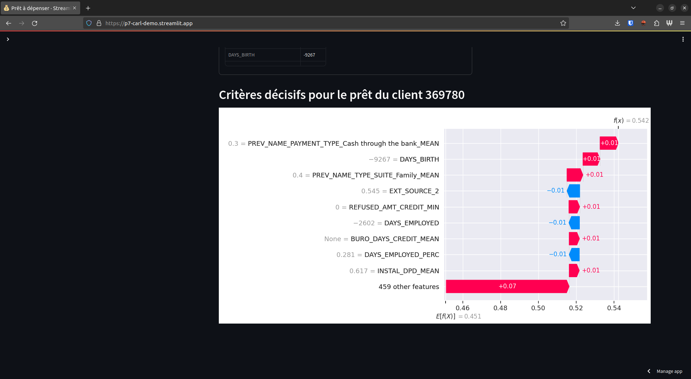
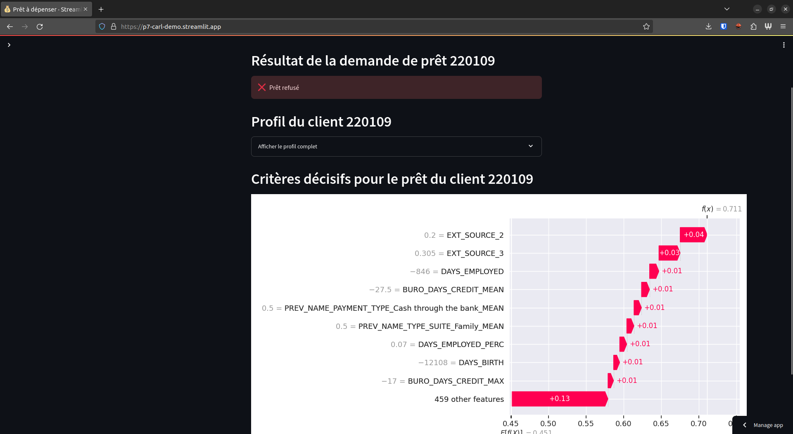

# P7_scoring_ML

<!--toc:start-->
- [P7_scoring_ML](#p7scoringml)
  - [Context](#context)
  - [Description](#description)
  - [Usage](#usage)
  - [Data](#data)
  - [Install](#install)
  - [Makefile](#makefile)
  - [Project Organization](#project-organization)
  - [Credits](#credits)
  - [Screenshots](#screenshots)
<!--toc:end-->


## Context

[Project briefing from OpenClassrooms](https://openclassrooms.com/fr/paths/164/projects/632/assignment)
> L’entreprise souhaite mettre en œuvre un outil de **“scoring crédit” pour calculer la probabilité qu’un client rembourse son crédit**, puis classifie la demande en crédit accordé ou refusé. Elle souhaite donc développer un **algorithme de classification** en s’appuyant sur des sources de données variées (données comportementales, données provenant d'autres institutions financières, etc.).  
> De plus, les chargés de relation client ont fait remonter le fait que les clients sont de plus en plus demandeurs de **transparence** vis-à-vis des décisions d’octroi de crédit. Cette demande de transparence des clients va tout à fait dans le sens des valeurs que l’entreprise veut incarner.  
> Prêt à dépenser décide donc de développer un **dashboard interactif** pour que les chargés de relation client puissent à la fois expliquer de façon la plus transparente possible les décisions d’octroi de crédit, mais également permettre à leurs clients de disposer de leurs informations personnelles et de les explorer facilement. 

## Description
API providing financial data about customers and their loan application results. The project is split in 3 github repositories:

1. [Machine learning](https://github.com/carlgennetais/P7_scoring_ML) (this one)
2. [Back: API built with FastAPI](https://github.com/carlgennetais/P7_scoring_back)
3. [Front: Dashboard built with Streamlit](https://github.com/carlgennetais/P7_scoring_front/)


## Usage
Visit the live URL : <https://p7-carl-demo.streamlit.app/>

## Data
<https://www.kaggle.com/c/home-credit-default-risk/data>

## Install
```
$ make requirements
$ make data           # automatically download and unzip dataset from Kaggle
```

## Makefile
```
Available rules:
clean               Delete all compiled Python files 
clean_code          Clean notebooks and python fils with black and isort 
create_environment  Set up python interpreter environment 
data                Make Dataset 
lint                Lint using flake8 
requirements        Install Python Dependencies 
test_environment    Test python environment is setup correctly 
update_API_models   Copy models to local repo of API 
```

## Project Organization

    ├── Makefile           <- Makefile with commands like `make data` or `make train`
    ├── README.md          <- This README
    ├── data
    │   ├── processed      <- The final, canonical data sets for modeling.
    │   └── raw            <- The original, immutable data dump.
    │
    ├── img                <- image folder
    │
    ├── models             <- Trained model and shap explanation
    │
    ├── notebooks          <- Jupyter notebooks. 
    │
    ├── references         <- Data dictionaries, manuals, and all other explanatory materials.
    │
    ├── reports            <- Generated analysis as HTML, PDF, LaTeX, etc.
    │   └── figures        <- Generated graphics and figures to be used in reporting
    │
    ├── requirements.txt   <- The requirements file for reproducing the analysis environment, e.g.
    │                         generated with `pip freeze > requirements.txt`
    │
    ├── setup.py           <- makes project pip installable (pip install -e .) so src can be imported
    │
    └── src                <- Source code for use in this project.
        ├── __init__.py    <- Makes src a Python module
        │
        └── features       <- Scripts to turn raw data into features for modeling
            └── lightgmb_with_simple_features.py      <- Kaggle Kernel


## Credits

* [Aguiar from Kaggle](https://www.kaggle.com/code/jsaguiar/lightgbm-with-simple-features/) for his Feature Engineering work
## Screenshots






